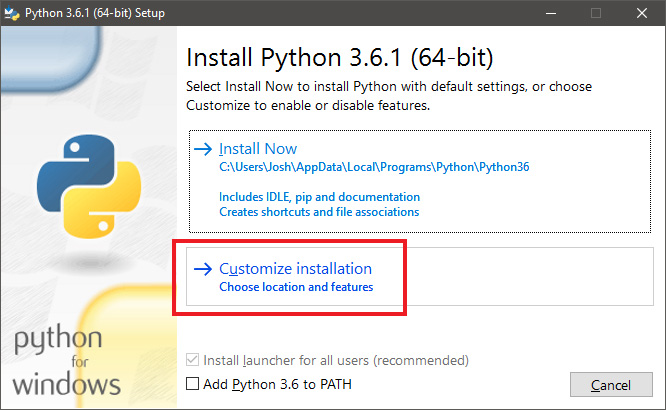
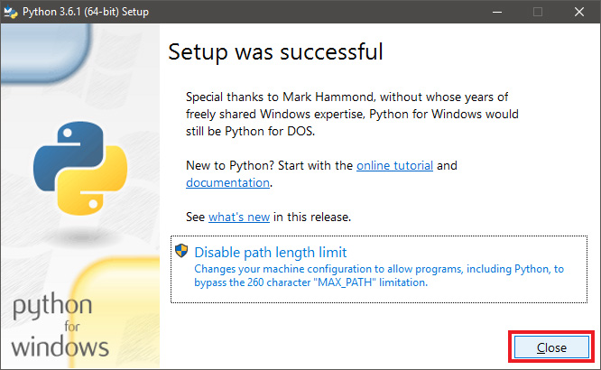

# CCircle.Setup.1 : Installing Python

* First, [download Python 3.6.1 (Windows/64)](https://www.python.org/ftp/python/3.6.1/python-3.6.1-amd64.exe)  
  Run the download when it finishes.

* At the first page of the installer, select "customize installation."  
  

* On the next page, leave everything as it is; just click "next" to move on.  
  

* On the next page you'll need to check two boxes that aren't checked by default.  
  Check the first box ("Install for all users") and the fourth box ("Add Python to environment variables").  
  Make sure your checkboxes match the image below!  
  

* Wait for the installer to run...  
  

* And close it when it completes (you don't need to click the "Disable path length limit" option).  
  

### Next -> [CCircle.Setup.2](setup2.html)
