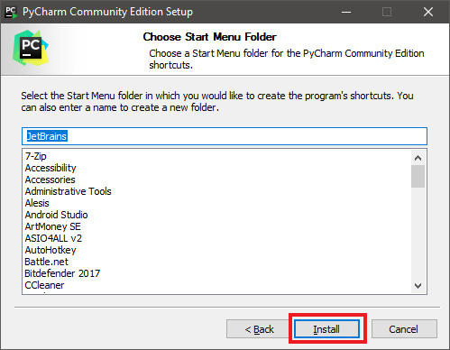

# CCircle.Setup.2 : Installing PyCharm
### Prev -> [CCircle.Setup.1](setup1)

* [Download PyCharm Community](https://www.jetbrains.com/pycharm/download/#section=windows)
* 
* 
* 
* 
* 
* 

### Next -> [CCircle.Setup.3](setup3)
